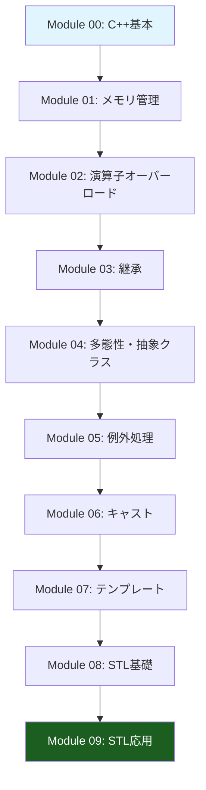

# 42 C++ Module

**製作者**: kmiyazawa  
**プロジェクト**: 42cursus C++ Module Learning Program

## 🎯 プロジェクト概要

このリポジトリは42cursusのC++学習プログラムで、10個のモジュール（Module 00～09）から構成されています。各モジュールは段階的にC++の重要な概念と機能を学習できるよう設計されており、基本的な文法から高度なSTL活用まで幅広くカバーしています。

## 📚 学習の流れ



## 📖 各モジュール詳細

| モジュール | 学習内容 | 主要概念 | 実装状況 |
|-----------|---------|----------|----------|
| [**Module 00**](./cppModule00/README.md) | C++基本文法とクラス | クラス・メンバ・入出力 | ✅ 完了 |
| [**Module 01**](./cppModule01/README.md) | メモリ管理とポインタ | new/delete・ポインタ・参照 | ✅ 完了 |
| [**Module 02**](./cppModule02/README.md) | 演算子オーバーロード | Orthodox Canonical Class Form | ✅ 完了 |
| [**Module 03**](./cppModule03/README.md) | 継承 | クラス継承・アクセス制御 | ✅ 完了 |
| [**Module 04**](./cppModule04/README.md) | 多態性と抽象クラス | 仮想関数・純粋仮想関数 | ✅ 完了 |
| [**Module 05**](./cppModule05/README.md) | 例外処理 | try/catch・カスタム例外 | ✅ 完了 |
| [**Module 06**](./cppModule06/README.md) | キャスト | static_cast・dynamic_cast等 | ✅ 完了 |
| [**Module 07**](./cppModule07/README.md) | テンプレート | 関数・クラステンプレート | ✅ 完了 |
| [**Module 08**](./cppModule08/README.md) | STL基礎 | コンテナ・イテレータ | ✅ 完了 |
| [**Module 09**](./cppModule09/README.md) | STL応用 | map・stack・実用アプリ | ✅ 完了 |

## 🎓 学習段階別構成

### 📝 基礎段階 (Module 00-01)
- **目標**: C++の基本文法とメモリ管理の理解
- **内容**: クラス、オブジェクト指向の基本、動的メモリ割り当て
- **成果物**: 電話帳アプリ、Zombieゲーム、ファイル処理ツール

### 🏗️ 中級段階 (Module 02-04)
- **目標**: オブジェクト指向プログラミングの完全理解
- **内容**: 演算子オーバーロード、継承、多態性
- **成果物**: 固定小数点クラス、ゲームキャラクター、動物クラス階層

### 🔧 上級段階 (Module 05-06)
- **目標**: 高度なC++機能の習得
- **内容**: 例外処理、型変換、安全なキャスト
- **成果物**: 官僚システム、型変換ツール、シリアライゼーション

### 🚀 専門段階 (Module 07-09)
- **目標**: 実用的なC++プログラミング技術の習得
- **内容**: テンプレート、STL、実用アプリケーション
- **成果物**: ジェネリック関数・クラス、Bitcoin取引所、計算機、ソートアルゴリズム

## 🛠️ 使用技術・概念

### Core C++ Features
```cpp
// 各モジュールで学習する主要技術
Module 00: Classes, Objects, I/O
Module 01: new/delete, Pointers, References
Module 02: Operator Overloading, OCCF
Module 03: Inheritance, Virtual Functions
Module 04: Polymorphism, Abstract Classes
Module 05: Exceptions, try/catch/throw
Module 06: static_cast, dynamic_cast, RTTI
Module 07: Templates, Generic Programming
Module 08: STL Containers, Iterators
Module 09: Advanced STL, Real Applications
```

### STL Components
- **コンテナ**: `vector`, `list`, `map`, `stack`, `deque`
- **アルゴリズム**: `find`, `sort`, `for_each`
- **イテレータ**: 前進・後退・ランダムアクセス
- **関数オブジェクト**: `std::function`, ラムダ式

## 📁 プロジェクト構造

```
42_cppModule/
├── README.md                 # このファイル
├── cppModule00/             # C++基本
│   ├── README.md
│   ├── ex00/                # Megaphone
│   ├── ex01/                # PhoneBook
│   └── ex02/                # Account
├── cppModule01/             # メモリ管理
│   ├── README.md
│   ├── ex00/                # Zombie
│   ├── ex01/                # Zombie Horde
│   ├── ex02/                # Brain
│   ├── ex03/                # Weapon
│   ├── ex04/                # File Replace
│   └── ex05/                # Harl
├── ...                      # 他のモジュール
└── cppModule09/             # STL応用
    ├── README.md
    ├── ex00/                # Bitcoin Exchange
    ├── ex01/                # RPN Calculator
    └── ex02/                # PmergeMe Sort
```

## 🚀 クイックスタート

### 前提条件
- **コンパイラ**: g++ または clang++ (C++98標準対応)
- **Make**: GNU Make
- **OS**: Linux, macOS, Windows (WSL)

### コンパイル・実行
```bash
# 任意のexerciseディレクトリで
cd cppModule00/ex00
make
./megaphone

# クリーンアップ
make clean  # オブジェクトファイル削除
make fclean # 実行ファイルも削除
make re     # 再コンパイル
```

## 📋 学習のポイント

### ✅ 重要な学習目標
1. **メモリ管理**: RAIIパターンの理解と実践
2. **オブジェクト指向**: カプセル化、継承、多態性の完全理解
3. **例外安全性**: 強い例外安全保証の実装
4. **テンプレート**: ジェネリックプログラミングの活用
5. **STL活用**: 実用的なC++プログラミング技術

### ⚠️ 注意点
- **C++98標準**: 最新のC++機能は使用不可
- **メモリリーク**: 全てのnewにはdeleteが必要
- **Orthodox Canonical Class Form**: コピーコンストラクタ、代入演算子の適切な実装
- **仮想デストラクタ**: 継承を使用する場合は必須

## 🔗 参考リンク

### 技術資料
- [Copy-and-Swap Idiom](https://w.wiki/DAqu) - 安全な代入演算子の実装
- [OEIS A001768](https://oeis.org/A001768) - Ford-Johnson Algorithm (Module 09)

### C++標準ライブラリ
- [cppreference.com](https://cppreference.com/) - C++リファレンス
- [ISO C++](https://isocpp.org/) - C++標準化委員会

## 🎯 学習の進め方

1. **順次学習**: Module 00から順番に進めることを推奨
2. **理解重視**: 各概念を完全に理解してから次へ進む
3. **実装重視**: 理論だけでなく実際にコードを書いて理解を深める
4. **復習**: 前のモジュールの内容を定期的に復習する

## 📧 お問い合わせ

**製作者**: kmiyazawa  
**プロジェクト**: 42cursus C++ Module

---

*このプロジェクトは42cursusの学習プログラムの一環として作成されました。*